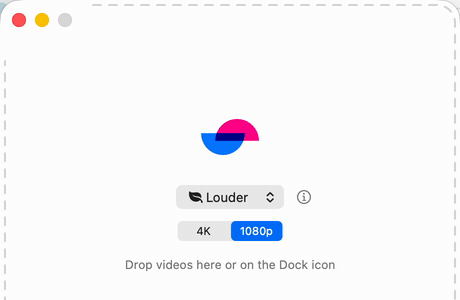
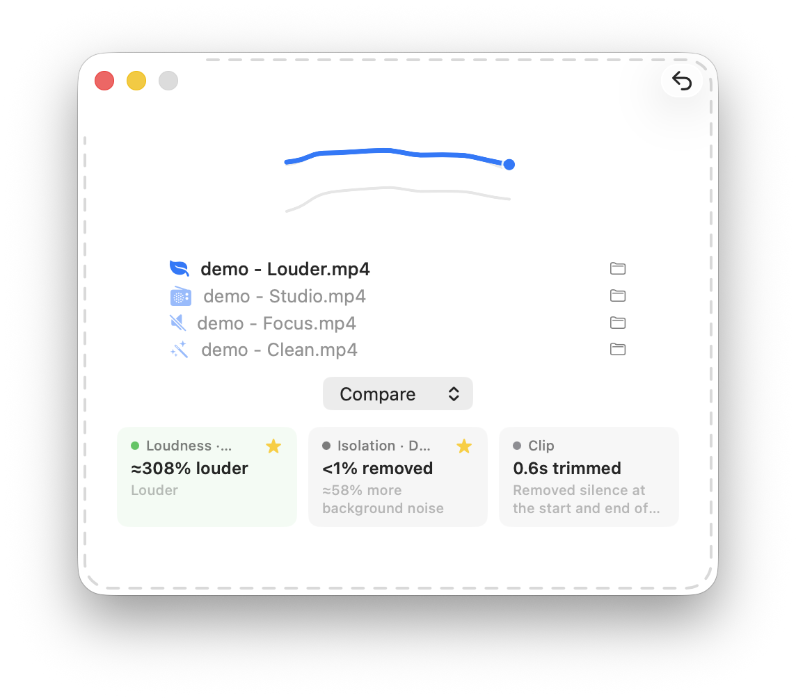

# Louder

Drop a video on it. The voice gets loud and clear. That's it.

Follow the build along in the **[devlog](https://berndpl.github.io/Louder/blog/)**.

Screencasts, demos, and meeting recordings almost always share one problem: the picture is fine, but the voice is quiet, thin, and buried under room noise.

Ever recorded a screencast on your EarPods and found the voice just isn't loud enough? You crank it up in post — and now it's loud *and* noisy, every crackle and breath boosted right along with it. This one's for you.

From a janky screen recording to a perfectly shareable video asset in a single step. Just drag your file onto Louder to enhance loudness, crop silence, remove noise, and re-encode — all at once. Pick a preset once and it writes the result back in place. No timeline, no plugins, nothing to configure.

## Download

Get the latest build from the **[Releases page](https://github.com/berndpl/Louder/releases/latest)**, unzip, and drag **Louder.app** into Applications. Apple Silicon only; you still need ffmpeg (see [Requirements](#requirements)).

The app is signed with a Developer ID but not yet notarized, so on first launch macOS warns that it can't verify the developer. Right-click the app → **Open** (once), or build it yourself from source below.

## What it does

Drag one or more video or audio files onto the Dock icon or the drop window. For each file, Louder:

1. Backs up the original to `<name> - original.<ext>` beside it.
2. Applies one remembered preset — **Louder**, **Studio**, **Focus**, or **Clean** (see [Presets](#presets)) — targeting a consistent **−16 LUFS**.
3. Adds natural 0.25-second fades at the start and end (toggle in Settings), then re-encodes audio as broadly-compatible **48 kHz AAC-LC** with `+faststart`.
4. Replaces the original in place. If a file fails, the original is left untouched.

Pick **Compare** (the last menu item) to leave the source alone and write one clearly named variant for every preset beside it, so you can A/B them. Each variant is saved as `<name> - <Preset>.<ext>` (e.g. `talk - Studio.mp4`).

After processing, the window stays open with compact loudness curves, integrated LUFS, an estimated signal-to-noise ratio, and a native Undo. Click any curve to hear that version; switching keeps the current timestamp for instant A/B.

## Presets

All presets target **−16 LUFS** and differ only in how they clean the voice before the boost. The **ⓘ** button beside the menu opens a schematic signal chain showing the exact models and parameters behind the selected preset.

| Preset | Signal path | Effect |
| --- | --- | --- |
| **Louder** | DeepFilterNet3 denoise → loudness boost | The safe default. Gentle stationary-noise cleanup, then brings the voice to a consistent level. |
| **Studio** | DeepFilterNet3 → studio EQ + compression → boost | A warm broadcast tone: rumble cut, low-end and presence shaping, gentle compression. |
| **Focus** | Event-gate (Apple SoundAnalysis) → DeepFilterNet3 → boost | Ducks intermittent events (a door, a dog, keyboard clatter) before denoising. Best for occasionally noisy rooms. |
| **Clean** | AI speech enhancement (neural model) → boost | Rebuilds the voice with an on-device neural model for the strongest cleanup. Band-limited, so clearer but slightly duller — try it when the others leave too much noise. |

## Output quality

A small **4K / 1080p** control on the drop screen sets a maximum output height (2160 or 1080) and is remembered between launches. It's a cap, not a forced size:

- A recording **at or below** the cap keeps its original video, copied untouched (the default, fastest path).
- A recording **above** the cap is downscaled and re-encoded to broadly-compatible **H.264 8-bit 4:2:0** (CRF 18, `veryfast`), preserving aspect ratio.

Whenever the video is actually re-encoded — by a downscale or a silence trim — a **Size** card shows the file-size change (e.g. `120 MB → 66 MB`); in a Compare batch the smallest variant is starred.

## Playback compatibility

Output audio is always 48 kHz AAC-LC and every file is written `+faststart` for instant playback on the web and devices. The video stream is copied untouched to preserve quality and speed, so its compatibility matches your source — Louder inspects the result and warns about limitations like **H.265 (HEVC)**, high-bit-depth/4:2:2 pixel formats, or an audio/video length mismatch. For the broadest reach, record in **H.264**.

Mono and stereo audio pass through untouched; surround (more than two channels, e.g. 5.1) is merged down to mono so it can't play back silent or broken on devices that can't decode the layout.

## Requirements

- macOS on **Apple Silicon** (the bundled DeepFilterNet denoiser is an `arm64` binary).
- ffmpeg via Homebrew: `brew install ffmpeg`. Louder looks in `/opt/homebrew/bin` and `/usr/local/bin`, and fails gracefully with this hint if it's missing.

DeepFilterNet 0.5.6 and the DeepFilterNet3 model are bundled. All cleanup runs locally; recordings are never uploaded.

## Building

Open `Louder.xcodeproj` in Xcode and run — nothing else to configure. The app is deliberately **not sandboxed** so it can rewrite files in place anywhere on disk, including cloud-synced folders like OneDrive (which triggers a one-time macOS permission prompt).

A Shortcuts Quick Action was tried first and abandoned: Quick Actions run inside Apple's sandboxed `siriactionsd` daemon, which can never be granted access to OneDrive/CloudStorage files. A real app in the user session gets the prompt once and works forever.

## Non-goals

No editing, format conversion, folder watching, arbitrary audio parameters, or App Store distribution. It's a personal tool that does one thing well.
